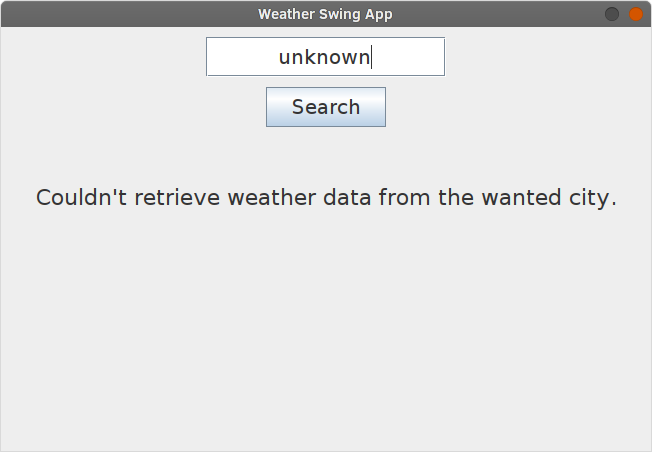

# Weather Swing App

**This project is my first application written in Java and is done for my own learning purposes!**

Tools and techniques used and studied in the project:
- Java (version 8)
- Java Swing (GUI)
- Maven (Dependencies & Build process)

The project follows **MVC** software design pattern:
- **M**: `WeatherStatus`
- **V**: `MainWindow`
- **C**: `AppEngine`

### Run it yourself
[Weatherstack](https://weatherstack.com/) API key is needed for the application to work. Make a copy of `.env.example`, rename it `.env` and fill in the API key.

Then you'll be able to run the application:

```
$ mvn package
$ mvn exec:java
```

### Screenshots

**Main view of the app**


**Successful weather search**


**Loading indicator**


**Error occurred during search**


